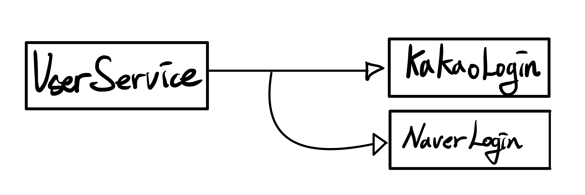
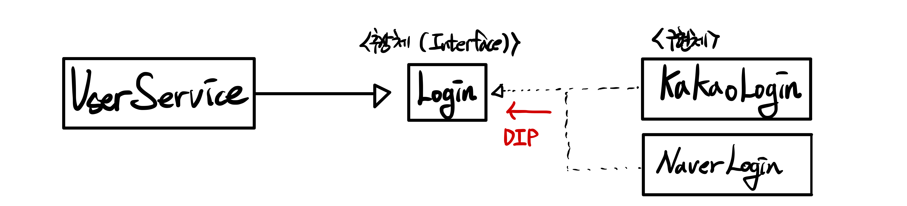

# Interface
>c++에서 h파일의 인터페이스와 구현파일을 나누는 것과 비슷하다.  
>구현해야할 메소드에 대한 규격을 정의 하는 것으로   
>**공통적인 기능을 명시**하고,  
>**강제적으로 구현하게 하는 역할**을 한다.
- 구현을 강제
- 다형성을 제공, 유지보수성 증가
- 의존성을 역전시켜 결합도를 낮출수 있음

<기존의 방식>  


<Interface 사용>  

→ DIP : Dependency Inversion Principle

### 구현
디자인패턴_생성패턴_factory패턴
```java
    //추상체
    public interface Login {
        void login();
    }
    //구현체
    public class KakaoLogin implements Login{
        @Override
        public void login(){
            System.out.println("카카오로 로그인 합니다.")
        }
    }

    public class NaverLogin implements Login{
        @Override
        public void login(){
            System.out.println("네이버로 로그인 합니다.")
        }
    }

    public class UserService implements Login{
        private Login login; 
        public UserService(Login login){
            this.login = login;
        }
        @Override
        public void login(){
            login.login();
        }
    }

    public class Main() {
        public static void main(String[] args){
            UserService s = new UserService(new KaKaoLogin());
            s.login();
        }
    }

```

# default Method

> default Method 기능은 사실 c++의 철학과 닮아 있어 어렵지 않게 이해할 수 있었다.

→ 인터페이스가 구현체를 가질 수 있게 됨

- 인터페이스 자체만으로 메소드를 추가할 수 있게 됨
- Adapter 역할을 하게 됨
- 함수 제공자가 됨 . (static method를 가질 수 있음)

# Funtional Interface

- 추상 메소드 하나만 존재하는 인터페이스 
⇒ default, static 예외
- Interface 임시 생성하기
⇒ 익명 클래스를 사용하여 인터페이스의 인스턴스를 생성하고 구현을 바로 정의하여 사용

```java
// 추상메소드가 하나밖에 없다. default와 static은 상관 X
@FunctionalInterface
interface MyMap{
    void map();
    default void sayHello(){
        System.out.println("Hello World");
    }
    static void sayBye(){
        System.out.println("Bye World");
    }
}
```

# Lambda 표현법

- 익명 클래스→익명 메소드를 사용하여 간결한 인터페이스 생성 (표현)법
- Funtional Interface에서 사용가능
- **Method reference 표현법**
⇒ lambda 표현법에서 입력되는 값의 변화없이 바로 출력하는 방법으로 더 줄일 수 있다.
- 인텔리제이에서 빠른수정키로 표현법 변화가 가능하다.

```java
public class Main2 {
    public static void main(String[] args) {
        
        //익명 클래스를 이용하여 바로사용 
        new MyRunnable(){
            @Override
            public void run() {
                System.out.println("Hello");
            }
        }.run();

        //익명 클래스를 사용해서 구현
        MyRunnable r1 = new MyRunnable(){
            @Override
            public void run() {
                System.out.println("Hello");
            }
        };

        //익명 메소드를 사용해서 표현하는 방법 : 람다 표현식 -> 간결하게 사용가능해짐
        //함수형 인터페이스만 가능
        MyRunnable r2 = ()-> System.out.println("Hello");

        //익명 클래스 사용해서 구현
        MySupply s1 = new MySupply() {
            @Override
            public String supply() {
                return "Hello World";
            }
        };
        
        //익명 메소드 return , {} 생략가능(한줄일때)
        MySupply s2 = () -> "Hello World ";
        //사용 예
        MyRunnable r3 = ()->{
            MySupply s3 = () -> "Hello Hello Hello";
            System.out.println(s3.supply());
        };
        r3.run();

				//Method reference 표기법
				//c++ Templete 와 같이 자료형 일반화, 여기서는 자료형에 대해서 인풋?으로 줄수도있음
				//레퍼런스 타입으로 해야함 즉 int 대신 Integer
        MyMapper <String,Integer> m = String::length;
    }
}
```