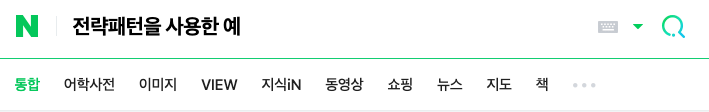
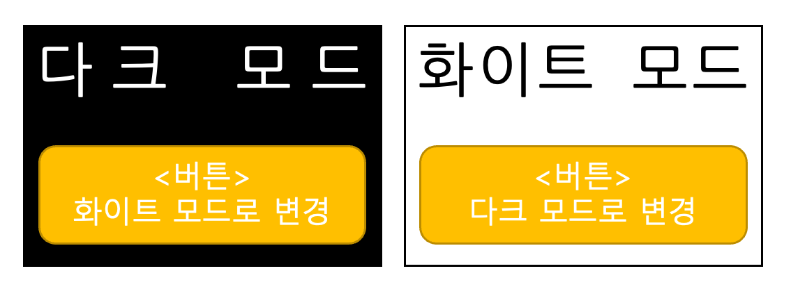

>객체지향 설계 원칙 SOLID의 확장판  
>23가지 디자인 패턴  

<br/>
<br/>  

# 23가지 디자인 패턴
- 웹에서 자주쓰이는 패턴 : 싱글톤, 팩토리메소드, 빌더, 전략, 프록시  
<br/>  

## **[생성 패턴]**  
- 추상 객체 인스턴스화  
### 1. Singleton 싱글톤

- 어떤 객체가 프로세스 내에서 단 하나만 만들어 져야 할때 사용한다. ex) 웹 페이지의 세팅값 ( 다크모드 )

⇒각각의 페이지에서 세팅값을 사용할 때마다 새로운 객체로 만들지 않고 공유해서 사용한다.

- 구현

    1) 생성자를 private 으로 만들고,  클래스안에 자기자신의 객체를 static(정적), null값 으로 선언한다.
    ⇒ 클래스 내의 static으로 선언된 변수들은 클래스로 만든 객체가 얼마든지간에 프로세스 내에서 하나만 생성함

    2) get객체 함수를 만들어 자기자신의 객체가 null일때 new로 한번만 생성되게 만든다.

     ⇒ 이미 생성되어있는데 어디선가 또 생성되면 그대로 있는 값을 반환하게 만드는 것이다.

    ```java
    public class Mode {
    	// 1)
    	private Mode () {};
    	private static Mode mode = null;
    	
    	// 2)
    	public static Mode getMode() {
    		if ( mode == null ) mode = new Mode();
    		return mode;
    	}
    }
    ```  
<br/>  

### 2. Factory Method 팩토리
- 구현  
```java
    //추상체
    public interface Login {
        void login();
    }
    //구현체
    public class KakaoLogin implements Login{
        @Override
        public void login(){
            System.out.println("카카오로 로그인 합니다.")
        }
    }

    public class NaverLogin implements Login{
        @Override
        public void login(){
            System.out.println("네이버로 로그인 합니다.")
        }
    }

    public class UserService implements Login{
        private Login login; 
        public UserService(Login login){
            this.login = login;
        }
        @Override
        public void login(){
            login.login();
        }
    }

    public class Main() {
        public static void main(String[] args){
            UserService s = new UserService(new KaKaoLogin());
            s.login();
        }
    }
```
<br/>  

### 3. Builder 빌더

<br/>  

### 4. Builder 추상 팩토리

<br/>  

### 5. Builder 프로토타입  

<br/>  
<br/>  

## **[구조 패턴]**  
- 객체 결합  
### 6. 프록시

<br/>  

### 7. 어댑터

<br/>  

### 8. 브리지

<br/>  

### 9. 컴포지트

<br/>  

### 10. 데코레이터

<br/>  

### 11. 파사드

<br/>  

### 12. 플라이웨이트

<br/>  
<br/>  

## **[행위 패턴]**  
- 객체 간 커뮤니케이션  
### 13. Strategy 전략

- 지정된 특정 메소드가 모듈화된 모드에 따라 다르게 실행되도록 할때 사용 ex) 이미지, 블로그 등 검색버튼
  
⇒ 검색버튼 : 이미지 검색, 지식in 검색 등 비슷하지만 다른 기능을 할때 
<br/>  

### 14. State 상태

- 전략패턴과 비슷하지만 다르다.
- 특정 상태마다 다르게 동작해야 할 때 사용한다 ex) 웹 페이지 다크모드 스위치
- 특정 상태마다 다르게 동작해야 할 일과 함께 모듈화로 지정함

<br/>  

### 15. Command 커맨드

- 전략패턴과 비슷하지만 다르다.
<br/>  


### 16. 책임 체인

<br/>  

### 17. 인터프리터

<br/>  

### 18. 반복자

<br/>  

### 19. 중재자

<br/>  

### 20. 메멘토

<br/>  

### 21. 옵저버

<br/>  

### 22. 템플릿 메소드

<br/>  

### 23. 방문자

<br/>  


